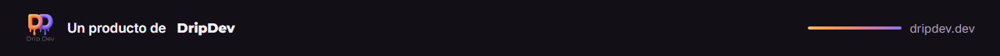
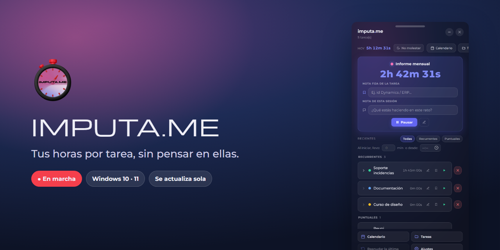
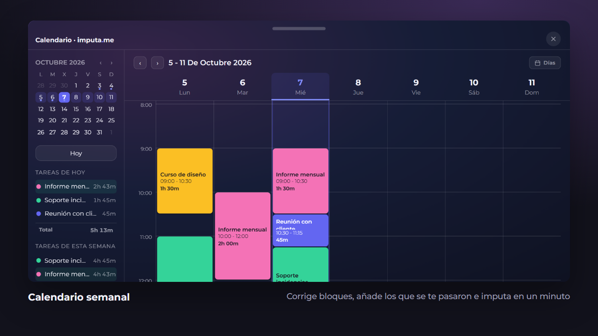

<a href="https://dripdev.dev"></a>

<p align="center">
  
</p>

<p align="center">
  <a href="https://github.com/roblesgg/imputa-me/releases/latest"></a>
  
  
</p>

**imputa.me** cuenta el tiempo que dedicas a cada tarea mientras trabajas. Un clic para empezar, otro para parar. A final de semana, el calendario te dice dónde fue cada hora, e imputar es copiar y pegar.

Vive en la bandeja del sistema y no molesta.

<p align="center">
  
</p>

## Qué puedes hacer

| | |
|---|---|
| ▶️ **Un botón por tarea** | Empezar, pausar o cambiar de tarea en un clic. Solo corre una a la vez. |
| 🗒️ **Notas** | Una fija por tarea (el código del proyecto, por ejemplo) y otra para cada sesión. |
| 📅 **Calendario semanal** | Ves tus bloques de tiempo, los corriges y añades los que se te pasaron. |
| ⏱️ **Recordatorio** | Un aviso discreto si una tarea lleva mucho rato corriendo. |
| ✅ **No pierde nada** | Cada cambio se guarda al momento. Ni un apagón te quita un minuto. |
| ☕ **No molestar** | Silencia los avisos cuando necesitas concentrarte. |

## Descárgala

En la [última versión](https://github.com/roblesgg/imputa-me/releases/latest):

| Archivo | Para quién |
|---|---|
| `imputame-setup.exe` | Instalador. **Se actualiza sola.** Recomendado. |
| `imputame-portable.exe` | Sin instalar, por ejemplo desde un USB. |

## Hecho con

Electron con HTML, CSS y JavaScript, sin framework. Tipografía Montserrat y el efecto translúcido de Windows 11.

<details>
<summary><b>Para desarrollar</b></summary>

<br>

```bash
npm install
npm start        # modo desarrollo
npm run dist     # instalador y portable en release/
```

Si lanzas la app desde una terminal con `ELECTRON_RUN_AS_NODE` definida, ábrela con `Iniciar imputa.me.vbs`. Todo el detalle técnico está en [`CONTEXTO.md`](CONTEXTO.md).

Las capturas de arriba son de la interfaz real de la app con tareas de ejemplo.

</details>

---

<p align="center"><sub>Un producto de <a href="https://dripdev.dev"><b>DripDev</b></a> · hecho por Álvaro Robles</sub></p>
