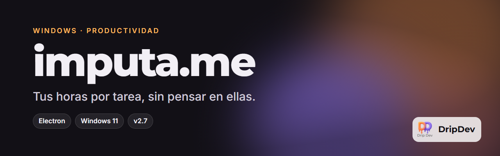

<p align="center">
  
</p>

<p align="center">
  <a href="https://github.com/roblesgg/imputa-me/releases/latest"></a>
  
  
</p>

**imputa.me** es una app de escritorio para Windows que cuenta el tiempo que dedicas a cada tarea. Vive en la bandeja del sistema, te recuerda qué tienes en marcha y, a final de semana, te enseña en un calendario dónde se fue cada hora para que imputarlas sea copiar y pegar.

<!-- Capturas: añade las imágenes en docs/capturas/ y descomenta esta sección.
## Capturas
<p align="center">
  
  
  
</p>
-->

## Qué puedes hacer

- **Un botón por tarea.** Dale a ▶ para empezar y a ⏸ para parar. Solo una tarea corre a la vez, así que cambiar de una a otra es un clic.
- **Cada tarea con su color**, para reconocerla de un vistazo en el panel y en el calendario.
- **Widget de esquina** que te recuerda cada cierto tiempo qué tarea sigue contando, por si se te olvidó pararla.
- **Calendario semanal** al estilo Outlook o Teams: ves tus bloques de tiempo, los corriges y añades los que se te pasaron.
- **Notas por tarea**, para apuntar qué hiciste mientras corría el reloj.
- **No pierde nada.** Cada cambio se guarda al momento en tu PC; si se apaga de golpe, al abrir sigue donde estaba.
- **Se actualiza sola** cuando sale una versión nueva.
- **Hecha para Windows 11**, con el efecto translúcido del sistema y modo claro u oscuro.

## Descárgala

En la [última versión](https://github.com/roblesgg/imputa-me/releases/latest) tienes dos opciones:

| Archivo | Para quién |
|---|---|
| `imputame-setup.exe` | Instalador. Se actualiza solo. **Recomendado.** |
| `imputame-portable.exe` | Sin instalar, por ejemplo desde un USB. |

## Hecho con

Electron 31 con HTML, CSS y JavaScript sin framework ni bundler. Instalador con electron-builder y actualizaciones con electron-updater desde GitHub Releases.

## Desarrollo

```bash
npm install
npm start        # abre la app en modo desarrollo
npm run dist     # genera instalador y portable en release/
```

> En Windows, abre la app con `Iniciar imputa.me.vbs` si la lanzas desde una terminal que tenga `ELECTRON_RUN_AS_NODE` definida. Los detalles técnicos están en [`CONTEXTO.md`](CONTEXTO.md).

## Estado

Publicada y en uso diario. Versión actual en la insignia de arriba.

---

<p align="center">
  <br>
  Un producto de <b>DripDev</b> · hecho por Álvaro Robles
</p>
